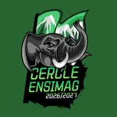
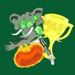
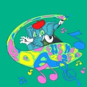

# Bureau Des Élèves (BDE)

{ width="150" }

Aka BDE ou Cercles des élèves, c'est l'association principale de l'Ensimag. Composée d’une quarantaine d’étudiant·es, elle accompagne les étudiants dès le premier jour de l'intégration avec les autres associations.

[Instagram](https://www.instagram.com/bde_ensimag/)

# Bureau Des Sports (BDS)

{ width="150" }

Le Bureau Des Sports, c’est l’association chargée de te faire bouger après ces dures années de prépa, et ce dès les semaines d’intégration ! Entre ski, pool party, paintball ou encore Laser Game, tout le monde y trouvera son bonheur, y compris les moins sportifs !

[Instagram](https://www.instagram.com/bds_ensimag/)

# Bureau Des Arts (BDA)

{ width="150" }

Le BDA, c’est l’association dont l’objectif est de promouvoir l’art et les activités culturelles à l’Ensimag. Il se charge, tout au long de l’année, d’organiser des ateliers artistiques ou "workshops". Parfait pour réveiller ton âme d’artiste ou de touche-à-tout !

[Instagram](https://www.instagram.com/bdaensimag/)

---
*Page maintenue par la communauté — [Propose une correction](https://github.com/Dehbiy/ENSIDOC/edit/main/docs/associations-inp/buraux.md)*